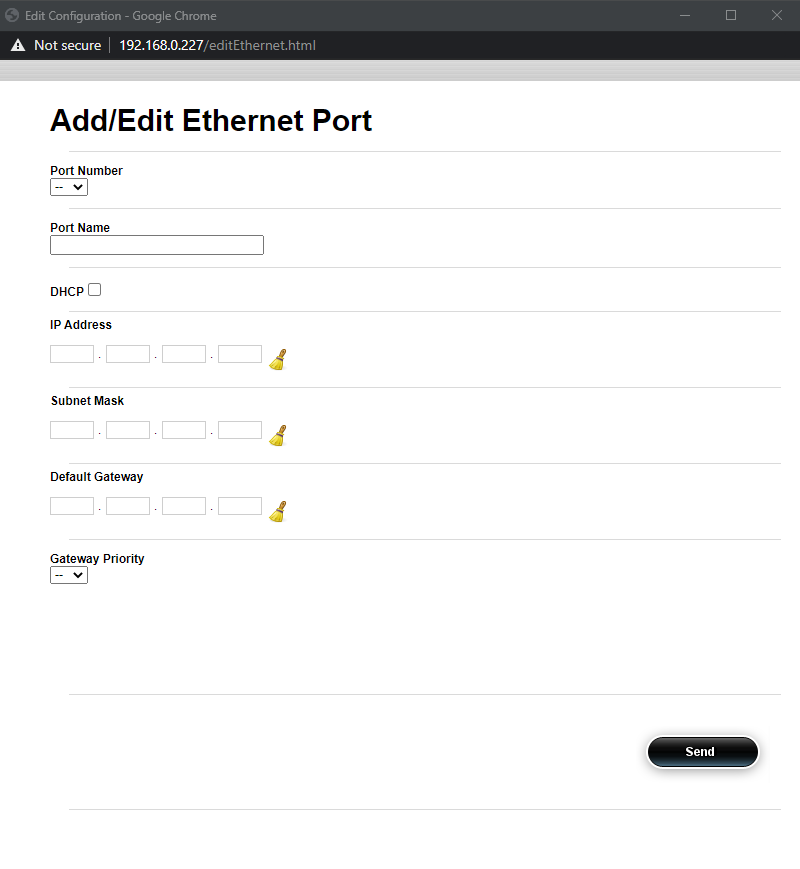

.. sectnum::
    :start: 2
.. include:: substitutions.rst

Unit Setup
===========
To setup a protected stream using two DVGs you will need to connect them to the internet or the simulated
internet test bench. One DVG will be used as the as the sender/protector and the other will be used as
the receiver/sentinel.

To connect the DVG instances to the test setup:

1. On the sender side, connect an RJ-45 cable from the source of the stream to physical port #1.
2. On the sender side, connect an RJ-45 cable from physical port #2 to the router.
3. On the sender side, connect an RJ-45 cable from from the physical port Mgmt to the management switch.
4. On the receiver side, connect an RJ-45 cable from physical port #1 to the decoder.
5. On the receiver side, connect an RJ-45 cable from physical port #2 to the router.
6. On the receiver side, connect an RJ-45 cable from from the physical port Mgmt to the management switch.
7. Connect an RJ-45 cable from the management switch to the management PC.

The following diagram shows how to connect the physical interfaces to the routers or the internet test bench.

Port Configuration
-------------------
After the devices have been connected physically, the ports will need to be configured.

Configuring the Management Port
^^^^^^^^^^^^^^^^^^^^^^^^^^^^^^^^
The management port is used to access the management user interface.

**Procedure**

#. Access the DVG through the default address http://<ip_address>.
#. Log in to the device using the userid/pass admin/admin.
#. Click the edit private menu.
#. Click the Configuration tab.
#. In the configuration tree, navigate to System > Management > Management_IP.
#. Click on the Set-If leaf.
#. In the Ip Address field, enter a management IP address.
#. In the subnet mask field, enter a subnet mask or leave the default.
#. In the Gateway field, enter a gateway address. (optional)
#. Click Perform to save the address.
#. The machine will need to be rebooted for the address to be saved.

|

   *Repeat the above procedure on the second DVG unit.*.

|

Configuring Data Ports
^^^^^^^^^^^^^^^^^^^^^^^
The DVG units will connect to the internet and to either an encoder or a decoder
using the physical interfaces of the unit. Physical interfaces are configured using the
quick configure icons. **Configure the interfaces on both DVG units using the procedures in this section.**

**Procedure**

#. Click the |nc| icon to open the Add/Edit Ethernet Port configuration window.

2. In the Port Number pane, select a port number.

.. note::
   Each port number corresponds to a physical interface.
   Port numbers that is greater than the number of physical interfaces on the unit cannot be added.

3. In the Port Name pane, enter a name for the port.
#. in the IP Address field, enter an IP address.
#. In the Subnet Mask pane, enter a subnet mask.
#. In the Default Gateway pane, enter a default gateway (optional).
#. In the Gateway Priority pane, select a value from the drop-down list.
#. Click Send to save the configuration.

*Repeat this procedure for all the required interfaces.*